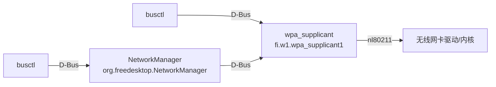
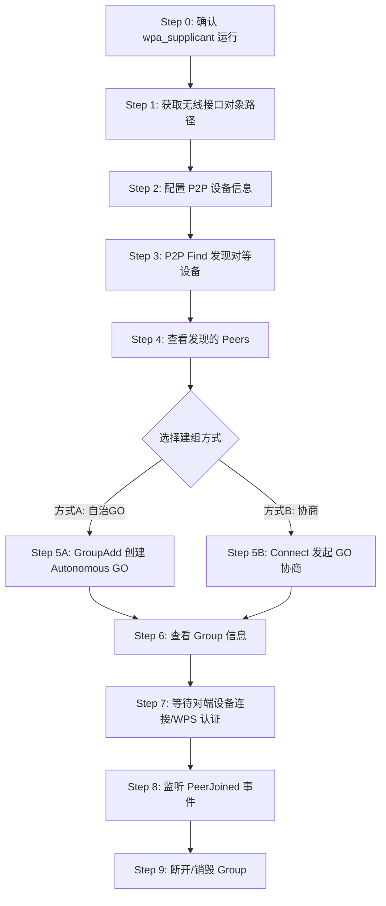
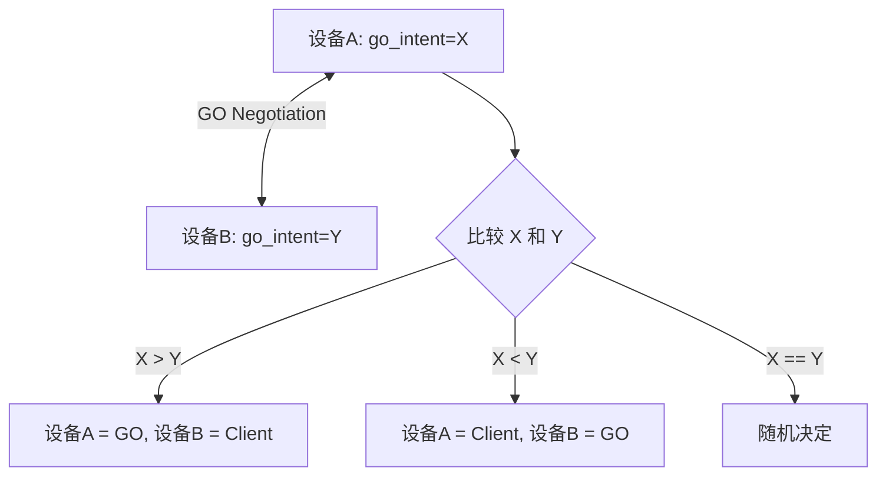

# 使用 busctl 通过 wpa_supplicant D-Bus API 完成 Wi-Fi Direct P2P 全流程

本文档基于 wpa_supplicant D-Bus API（`fi.w1.wpa_supplicant1`）文档，给出使用 `busctl` 命令行工具完成以下场景的完整步骤：

> **场景**：Linux 设备作为 **Group Owner (GO)** 创建一个 P2P Group，然后让其他支持 Wi-Fi Direct 的设备（手机、平板等）连接进来。

---

## 前置知识

### 关键 D-Bus 坐标

| 项目 | 值 |
|------|------|
| **服务名 (Bus Name)** | `fi.w1.wpa_supplicant1` |
| **主对象路径** | `/fi/w1/wpa_supplicant1` |
| **接口对象路径** | `/fi/w1/wpa_supplicant1/Interfaces/<N>` |
| **P2PDevice 接口** | `fi.w1.wpa_supplicant1.Interface.P2PDevice` |
| **Interface 接口** | `fi.w1.wpa_supplicant1.Interface` |
| **Group 接口** | `fi.w1.wpa_supplicant1.Group` |
| **Peer 接口** | `fi.w1.wpa_supplicant1.Peer` |
| **WPS 接口** | `fi.w1.wpa_supplicant1.Interface.WPS` |
| **Properties 接口** | `org.freedesktop.DBus.Properties` |

### 与 NetworkManager 方式的区别



- **本文档**：直接调用 wpa_supplicant 的 D-Bus API（更底层，控制更精细）
- **之前的方式**：通过 NetworkManager 的 D-Bus API（更高层，NetworkManager 内部再调用 wpa_supplicant）

---

## 全流程概览



---

## Step 0: 确认 wpa_supplicant 正在运行

```bash
# 检查 wpa_supplicant 是否在 D-Bus 上注册
sudo busctl status fi.w1.wpa_supplicant1
```

如果返回错误，说明 wpa_supplicant 未运行或未启用 D-Bus 接口。需要确保 wpa_supplicant 以 `-u` 参数启动（启用 D-Bus）：

```bash
# 启动 wpa_supplicant（如果未运行）
sudo wpa_supplicant -B -i wlan0 -c /etc/wpa_supplicant/wpa_supplicant.conf -u
```

也可以用 `busctl tree` 查看 wpa_supplicant 暴露的完整对象树：

```bash
sudo busctl tree fi.w1.wpa_supplicant1
```

输出示例：
```
└─/fi
  └─/fi/w1
    └─/fi/w1/wpa_supplicant1
      └─/fi/w1/wpa_supplicant1/Interfaces
        └─/fi/w1/wpa_supplicant1/Interfaces/0
```

---

## Step 1: 获取无线接口的 D-Bus 对象路径

### 方式一：通过接口名获取（推荐）

使用 `fi.w1.wpa_supplicant1` 主接口的 `GetInterface` 方法：

```bash
# 获取 wlan0 对应的 D-Bus 对象路径
sudo busctl call fi.w1.wpa_supplicant1 \
  /fi/w1/wpa_supplicant1 \
  fi.w1.wpa_supplicant1 \
  GetInterface \
  s "wlan0"
```

返回示例：
```
o "/fi/w1/wpa_supplicant1/Interfaces/0"
```

> 记住这个路径，后续所有操作都基于它。下文用 `$IFACE` 表示，例如 `/fi/w1/wpa_supplicant1/Interfaces/0`。

### 方式二：列出所有接口

```bash
sudo busctl get-property fi.w1.wpa_supplicant1 \
  /fi/w1/wpa_supplicant1 \
  fi.w1.wpa_supplicant1 \
  Interfaces
```

返回示例：
```
ao 1 "/fi/w1/wpa_supplicant1/Interfaces/0"
```

### 验证接口信息

```bash
# 查看接口名
sudo busctl get-property fi.w1.wpa_supplicant1 \
  /fi/w1/wpa_supplicant1/Interfaces/0 \
  fi.w1.wpa_supplicant1.Interface \
  Ifname

# 查看驱动
sudo busctl get-property fi.w1.wpa_supplicant1 \
  /fi/w1/wpa_supplicant1/Interfaces/0 \
  fi.w1.wpa_supplicant1.Interface \
  Driver

# 检查是否支持 P2P（查看 Capabilities 中是否包含 "p2p"）
sudo busctl get-property fi.w1.wpa_supplicant1 \
  /fi/w1/wpa_supplicant1 \
  fi.w1.wpa_supplicant1 \
  Capabilities
```

---

## Step 2: 配置 P2P 设备信息（可选）

通过设置 `P2PDeviceConfig` 属性来配置本设备的 P2P 信息，如设备名、GO Intent 等：

```bash
# 设置 P2P 设备名称和 GO Intent
sudo busctl set-property fi.w1.wpa_supplicant1 \
  /fi/w1/wpa_supplicant1/Interfaces/0 \
  fi.w1.wpa_supplicant1.Interface.P2PDevice \
  P2PDeviceConfig "a{sv}" 2 \
    "DeviceName" s "MyLinuxGO" \
    "GOIntent" u 15
```

**P2PDeviceConfig 常用字段**：

| 字段 | 类型 | 说明 |
|------|------|------|
| `DeviceName` | `s` | 设备名称，其他设备发现时会看到 |
| `GOIntent` | `u` | GO 意愿值 0-15，15 表示强制当 GO |
| `ListenChannel` | `u` | 监听信道 |
| `OperChannel` | `u` | 操作信道 |
| `SsidPostfix` | `s` | SSID 后缀 |
| `PersistentReconnect` | `b` | 是否自动重连持久组 |

---

## Step 3: P2P Find（发现对等设备）

调用 `fi.w1.wpa_supplicant1.Interface.P2PDevice` 接口的 `Find` 方法：

```bash
# 启动 P2P 发现，超时 30 秒
sudo busctl call fi.w1.wpa_supplicant1 \
  /fi/w1/wpa_supplicant1/Interfaces/0 \
  fi.w1.wpa_supplicant1.Interface.P2PDevice \
  Find \
  "a{sv}" 1 "Timeout" i 30
```

**Find 方法参数**：

| Key | 类型 | 说明 |
|-----|------|------|
| `Timeout` | `i` | 超时秒数，0 表示不超时 |
| `DiscoveryType` | `s` | `"start_with_full"`（默认）、`"social"`、`"progressive"` |

### 停止发现

```bash
sudo busctl call fi.w1.wpa_supplicant1 \
  /fi/w1/wpa_supplicant1/Interfaces/0 \
  fi.w1.wpa_supplicant1.Interface.P2PDevice \
  StopFind
```

### 监听发现事件（另开终端）

```bash
# 实时监听 DeviceFound / DeviceLost 信号
sudo busctl monitor fi.w1.wpa_supplicant1
```

会看到类似输出：
```
‣ Type=signal  Endian=l  Flags=1  Version=1
  Path=/fi/w1/wpa_supplicant1/Interfaces/0
  Interface=fi.w1.wpa_supplicant1.Interface.P2PDevice
  Member=DeviceFound
  OBJECT_PATH "/fi/w1/wpa_supplicant1/Peers/aabbccddeeff"
```

---

## Step 4: 查看发现的 Peers

### 列出所有已发现的 Peer

```bash
sudo busctl get-property fi.w1.wpa_supplicant1 \
  /fi/w1/wpa_supplicant1/Interfaces/0 \
  fi.w1.wpa_supplicant1.Interface.P2PDevice \
  Peers
```

返回示例：
```
ao 2 "/fi/w1/wpa_supplicant1/Peers/aabbccddeeff" "/fi/w1/wpa_supplicant1/Peers/112233445566"
```

### 查看 Peer 详细信息

```bash
# 查看 Peer 的设备名
sudo busctl get-property fi.w1.wpa_supplicant1 \
  /fi/w1/wpa_supplicant1/Peers/aabbccddeeff \
  fi.w1.wpa_supplicant1.Peer \
  DeviceName

# 查看 Peer 的设备地址
sudo busctl get-property fi.w1.wpa_supplicant1 \
  /fi/w1/wpa_supplicant1/Peers/aabbccddeeff \
  fi.w1.wpa_supplicant1.Peer \
  DeviceAddress

# 查看 Peer 的厂商信息
sudo busctl get-property fi.w1.wpa_supplicant1 \
  /fi/w1/wpa_supplicant1/Peers/aabbccddeeff \
  fi.w1.wpa_supplicant1.Peer \
  Manufacturer

# 查看 Peer 的型号名
sudo busctl get-property fi.w1.wpa_supplicant1 \
  /fi/w1/wpa_supplicant1/Peers/aabbccddeeff \
  fi.w1.wpa_supplicant1.Peer \
  ModelName

# 用 introspect 一次性查看所有属性
sudo busctl introspect fi.w1.wpa_supplicant1 \
  /fi/w1/wpa_supplicant1/Peers/aabbccddeeff
```

---

## Step 5A: 创建 Autonomous GO（推荐 — 确保 Linux 为 GO）

**Autonomous GO** 模式下，Linux 直接成为 Group Owner，无需与对端协商。其他设备可以主动发现并加入这个 Group。

调用 `GroupAdd` 方法（**不指定 peer**）：

```bash
# 创建非持久的 Autonomous GO，指定工作频率为 5 GHz (5180 MHz, 信道 36)
sudo busctl call fi.w1.wpa_supplicant1 \
  /fi/w1/wpa_supplicant1/Interfaces/0 \
  fi.w1.wpa_supplicant1.Interface.P2PDevice \
  GroupAdd \
  "a{sv}" 2 \
    "persistent" b false \
    "frequency" i 5180
```

### 使用 2.4 GHz 频段

```bash
# 2.4 GHz, 信道 6 (2437 MHz)
sudo busctl call fi.w1.wpa_supplicant1 \
  /fi/w1/wpa_supplicant1/Interfaces/0 \
  fi.w1.wpa_supplicant1.Interface.P2PDevice \
  GroupAdd \
  "a{sv}" 2 \
    "persistent" b false \
    "frequency" i 2437
```

### 创建持久 Group

```bash
# 持久 Group（设备断开后可以快速重连）
sudo busctl call fi.w1.wpa_supplicant1 \
  /fi/w1/wpa_supplicant1/Interfaces/0 \
  fi.w1.wpa_supplicant1.Interface.P2PDevice \
  GroupAdd \
  "a{sv}" 1 \
    "persistent" b true
```

### 不指定任何参数（使用默认配置）

```bash
sudo busctl call fi.w1.wpa_supplicant1 \
  /fi/w1/wpa_supplicant1/Interfaces/0 \
  fi.w1.wpa_supplicant1.Interface.P2PDevice \
  GroupAdd \
  "a{sv}" 0
```

**GroupAdd 参数说明**：

| Key | 类型 | 说明 |
|-----|------|------|
| `persistent` | `b` | 是否创建持久组 |
| `persistent_group_object` | `o` | 重新激活一个已有的持久组（对象路径） |
| `frequency` | `i` | 工作频率（MHz），如 2437 = 2.4G CH6，5180 = 5G CH36 |

### 常用频率参考

| 频段 | 信道 | 频率 (MHz) |
|------|------|-----------|
| 2.4 GHz | 1 | 2412 |
| 2.4 GHz | 6 | 2437 |
| 2.4 GHz | 11 | 2462 |
| 5 GHz | 36 | 5180 |
| 5 GHz | 40 | 5200 |
| 5 GHz | 44 | 5220 |
| 5 GHz | 48 | 5240 |
| 5 GHz | 149 | 5745 |

---

## Step 5B: 通过 GO 协商连接（Connect 方法）

如果你想通过 GO 协商方式建组（角色由 `go_intent` 决定），使用 `Connect` 方法：

```bash
# 发起 GO 协商，go_intent=15 表示强制当 GO，使用 PBC 方式
sudo busctl call fi.w1.wpa_supplicant1 \
  /fi/w1/wpa_supplicant1/Interfaces/0 \
  fi.w1.wpa_supplicant1.Interface.P2PDevice \
  Connect \
  "a{sv}" 3 \
    "peer" o "/fi/w1/wpa_supplicant1/Peers/aabbccddeeff" \
    "go_intent" i 15 \
    "wps_method" s "pbc"
```

**Connect 参数说明**：

| Key | 类型 | 说明 | 必填 |
|-----|------|------|------|
| `peer` | `o` | 对端 Peer 的 D-Bus 对象路径 | ✅ |
| `wps_method` | `s` | `"pbc"`、`"display"`、`"keypad"`、`"pin"` | ✅ |
| `go_intent` | `i` | GO 意愿值 0-15（15=强制GO，0=强制Client） | ❌ |
| `persistent` | `b` | 是否建立持久组 | ❌ |
| `join` | `b` | 是否加入已有的组（而非新建） | ❌ |
| `authorize_only` | `b` | 仅授权，等待对端发起协商 | ❌ |
| `frequency` | `i` | 工作频率 (MHz) | ❌ |
| `pin` | `s` | WPS PIN 码 | ❌ |

### GO 协商角色决定规则



---

## Step 6: 查看 Group 信息

Group 创建成功后，wpa_supplicant 会发出 `GroupStarted` 信号。你可以通过以下方式获取 Group 信息：

### 获取 Group 对象路径

```bash
# 查看当前 Group 对象路径
sudo busctl get-property fi.w1.wpa_supplicant1 \
  /fi/w1/wpa_supplicant1/Interfaces/0 \
  fi.w1.wpa_supplicant1.Interface.P2PDevice \
  Group
```

返回示例：
```
o "/fi/w1/wpa_supplicant1/Interfaces/1"
```

> ⚠️ 注意：Group 创建后，wpa_supplicant 通常会创建一个**新的虚拟接口**（如 `p2p-wlan0-0`），Group 对象路径指向这个新接口。

### 查看 Group 详细属性

```bash
# 假设 Group 接口路径为 /fi/w1/wpa_supplicant1/Interfaces/1

# 查看角色（GO 或 client）
sudo busctl get-property fi.w1.wpa_supplicant1 \
  /fi/w1/wpa_supplicant1/Interfaces/1 \
  fi.w1.wpa_supplicant1.Group \
  Role

# 查看 Group SSID
sudo busctl get-property fi.w1.wpa_supplicant1 \
  /fi/w1/wpa_supplicant1/Interfaces/1 \
  fi.w1.wpa_supplicant1.Group \
  SSID

# 查看 Group BSSID（GO 的 P2P 接口地址）
sudo busctl get-property fi.w1.wpa_supplicant1 \
  /fi/w1/wpa_supplicant1/Interfaces/1 \
  fi.w1.wpa_supplicant1.Group \
  BSSID

# 查看工作频率
sudo busctl get-property fi.w1.wpa_supplicant1 \
  /fi/w1/wpa_supplicant1/Interfaces/1 \
  fi.w1.wpa_supplicant1.Group \
  Frequency

# 查看密码（GO 端可用）
sudo busctl get-property fi.w1.wpa_supplicant1 \
  /fi/w1/wpa_supplicant1/Interfaces/1 \
  fi.w1.wpa_supplicant1.Group \
  Passphrase

# 查看 PSK
sudo busctl get-property fi.w1.wpa_supplicant1 \
  /fi/w1/wpa_supplicant1/Interfaces/1 \
  fi.w1.wpa_supplicant1.Group \
  PSK

# 查看已连接的成员（仅 GO 端有效）
sudo busctl get-property fi.w1.wpa_supplicant1 \
  /fi/w1/wpa_supplicant1/Interfaces/1 \
  fi.w1.wpa_supplicant1.Group \
  Members

# 用 introspect 一次性查看所有属性和方法
sudo busctl introspect fi.w1.wpa_supplicant1 \
  /fi/w1/wpa_supplicant1/Interfaces/1
```

### 查看 Group 接口的网络接口名

```bash
sudo busctl get-property fi.w1.wpa_supplicant1 \
  /fi/w1/wpa_supplicant1/Interfaces/1 \
  fi.w1.wpa_supplicant1.Interface \
  Ifname
```

返回示例：`s "p2p-wlan0-0"`

---

## Step 7: 等待对端设备连接 — WPS 认证

Group 创建后，对端设备（如手机）可以在 Wi-Fi Direct / Wi-Fi 设置中看到你的 GO。连接时需要完成 WPS 认证。

### 方式一：PBC（Push Button Configuration）— 最简单

对端设备发起连接请求后，在 GO 端授权 WPS PBC：

```bash
# 在 Group 接口上启动 WPS PBC（注意：要在 Group 接口上操作，不是原始接口）
sudo busctl call fi.w1.wpa_supplicant1 \
  /fi/w1/wpa_supplicant1/Interfaces/1 \
  fi.w1.wpa_supplicant1.Interface.WPS \
  Start \
  "a{sv}" 2 \
    "Role" s "registrar" \
    "Type" s "pbc"
```

> **关键点**：GO 端的 WPS 角色是 `"registrar"`（注册器），对端设备是 `"enrollee"`（注册者）。

### 方式二：PIN 方式

如果对端设备显示了一个 PIN 码：

```bash
# 在 GO 端输入对端设备显示的 PIN
sudo busctl call fi.w1.wpa_supplicant1 \
  /fi/w1/wpa_supplicant1/Interfaces/1 \
  fi.w1.wpa_supplicant1.Interface.WPS \
  Start \
  "a{sv}" 3 \
    "Role" s "registrar" \
    "Type" s "pin" \
    "Pin" s "12345678"
```

### 方式三：使用 P2PDeviceAddress 指定对端

```bash
# 指定允许连接的对端 P2P 设备地址
sudo busctl call fi.w1.wpa_supplicant1 \
  /fi/w1/wpa_supplicant1/Interfaces/1 \
  fi.w1.wpa_supplicant1.Interface.WPS \
  Start \
  "a{sv}" 3 \
    "Role" s "registrar" \
    "Type" s "pbc" \
    "P2PDeviceAddress" ay 6 0xaa 0xbb 0xcc 0xdd 0xee 0xff
```

---

## Step 8: 监听连接事件

### 监听 PeerJoined / PeerDisconnected 信号

在另一个终端中运行：

```bash
sudo busctl monitor fi.w1.wpa_supplicant1
```

当对端设备成功连接后，会看到 `PeerJoined` 信号：

```
‣ Type=signal  Endian=l  Flags=1  Version=1
  Path=/fi/w1/wpa_supplicant1/Interfaces/1
  Interface=fi.w1.wpa_supplicant1.Group
  Member=PeerJoined
  OBJECT_PATH "/fi/w1/wpa_supplicant1/Peers/aabbccddeeff"
```

当对端断开时，会看到 `PeerDisconnected` 信号。

### 查看当前 Group 成员

```bash
sudo busctl get-property fi.w1.wpa_supplicant1 \
  /fi/w1/wpa_supplicant1/Interfaces/1 \
  fi.w1.wpa_supplicant1.Group \
  Members
```

### 监听 StaAuthorized / StaDeauthorized 信号

这些信号在 `fi.w1.wpa_supplicant1.Interface` 接口上发出：

```
‣ Type=signal
  Interface=fi.w1.wpa_supplicant1.Interface
  Member=StaAuthorized
  STRING "aa:bb:cc:dd:ee:ff"
```

---

## Step 9: 断开连接 / 销毁 Group

### 移除特定 Client

```bash
# 从 Group 中移除指定 Client
sudo busctl call fi.w1.wpa_supplicant1 \
  /fi/w1/wpa_supplicant1/Interfaces/0 \
  fi.w1.wpa_supplicant1.Interface.P2PDevice \
  RemoveClient \
  "a{sv}" 1 \
    "peer" o "/fi/w1/wpa_supplicant1/Peers/aabbccddeeff"
```

### 销毁整个 Group

```bash
# 终止 P2P Group（注意：需要在 Group 接口上调用）
sudo busctl call fi.w1.wpa_supplicant1 \
  /fi/w1/wpa_supplicant1/Interfaces/1 \
  fi.w1.wpa_supplicant1.Interface.P2PDevice \
  Disconnect
```

### 清空 P2P 状态

```bash
# 清空 P2P peer 表和状态
sudo busctl call fi.w1.wpa_supplicant1 \
  /fi/w1/wpa_supplicant1/Interfaces/0 \
  fi.w1.wpa_supplicant1.Interface.P2PDevice \
  Flush
```

---

## 完整操作示例（一键脚本化）

以下是一个完整的操作序列，从头到尾创建 Autonomous GO 并等待连接：

```bash
#!/bin/bash
# Wi-Fi Direct P2P Autonomous GO - Full Flow via busctl
# 需要 root 权限运行

set -e

SERVICE="fi.w1.wpa_supplicant1"
WPA_PATH="/fi/w1/wpa_supplicant1"
P2P_IFACE="fi.w1.wpa_supplicant1.Interface.P2PDevice"
IFACE_IFACE="fi.w1.wpa_supplicant1.Interface"
GROUP_IFACE="fi.w1.wpa_supplicant1.Group"
WPS_IFACE="fi.w1.wpa_supplicant1.Interface.WPS"
PROPS_IFACE="org.freedesktop.DBus.Properties"

echo "=== Step 1: Get interface path ==="
IFACE_PATH=$(sudo busctl call $SERVICE $WPA_PATH $SERVICE GetInterface s "wlan0" | awk '{print $2}' | tr -d '"')
echo "Interface path: $IFACE_PATH"

echo ""
echo "=== Step 2: Configure P2P device ==="
sudo busctl set-property $SERVICE $IFACE_PATH $P2P_IFACE \
  P2PDeviceConfig "a{sv}" 2 \
    "DeviceName" s "MyLinuxGO" \
    "GOIntent" u 15
echo "P2P device configured."

echo ""
echo "=== Step 3: Create Autonomous GO ==="
sudo busctl call $SERVICE $IFACE_PATH $P2P_IFACE \
  GroupAdd "a{sv}" 2 \
    "persistent" b false \
    "frequency" i 2437
echo "GroupAdd called. Waiting for group to start..."
sleep 2

echo ""
echo "=== Step 4: Get Group info ==="
GROUP_PATH=$(sudo busctl get-property $SERVICE $IFACE_PATH $P2P_IFACE Group | awk '{print $2}' | tr -d '"')
echo "Group path: $GROUP_PATH"

echo ""
echo "--- Group Details ---"
echo -n "Role: "
sudo busctl get-property $SERVICE $GROUP_PATH $GROUP_IFACE Role
echo -n "SSID: "
sudo busctl get-property $SERVICE $GROUP_PATH $GROUP_IFACE SSID
echo -n "Frequency: "
sudo busctl get-property $SERVICE $GROUP_PATH $GROUP_IFACE Frequency
echo -n "Passphrase: "
sudo busctl get-property $SERVICE $GROUP_PATH $GROUP_IFACE Passphrase
echo -n "Interface: "
sudo busctl get-property $SERVICE $GROUP_PATH $IFACE_IFACE Ifname

echo ""
echo "=== Step 5: Start WPS PBC for incoming connections ==="
sudo busctl call $SERVICE $GROUP_PATH $WPS_IFACE \
  Start "a{sv}" 2 \
    "Role" s "registrar" \
    "Type" s "pbc"
echo "WPS PBC started. Waiting for device to connect..."

echo ""
echo "=== Step 6: Monitoring events (Ctrl+C to stop) ==="
echo "Now connect your Wi-Fi Direct device to the group."
echo "Monitoring for PeerJoined events..."
sudo busctl monitor $SERVICE
```

---

## 附录 A: 信号参考

### GroupStarted 信号

Group 创建成功后发出，包含以下信息：

| Key | 类型 | 说明 |
|-----|------|------|
| `interface_object` | `o` | Group 所在接口的 D-Bus 路径 |
| `role` | `s` | `"GO"` 或 `"client"` |
| `group_object` | `o` | Group 的 D-Bus 路径 |

### GroupFinished 信号

Group 被销毁时发出，字段同上。

### GONegotiationSuccess 信号

GO 协商成功后发出：

| Key | 类型 | 说明 |
|-----|------|------|
| `peer_object` | `o` | 对端 Peer 路径 |
| `role_go` | `s` | `"GO"` 或 `"client"` |
| `passphrase` | `s` | 密码（仅当本设备为 GO 时） |
| `ssid` | `ay` | SSID |
| `wps_method` | `s` | WPS 方法 |

### GONegotiationFailure 信号

GO 协商失败时发出：

| Key | 类型 | 说明 |
|-----|------|------|
| `peer_object` | `o` | 对端 Peer 路径 |
| `status` | `i` | 错误状态码 |

---

## 附录 B: Invite 已知设备重新加入

如果之前建立过持久组，可以邀请已知设备重新加入：

```bash
# 查看持久组列表
sudo busctl get-property fi.w1.wpa_supplicant1 \
  /fi/w1/wpa_supplicant1/Interfaces/0 \
  fi.w1.wpa_supplicant1.Interface.P2PDevice \
  PersistentGroups

# 邀请 Peer 加入持久组
sudo busctl call fi.w1.wpa_supplicant1 \
  /fi/w1/wpa_supplicant1/Interfaces/0 \
  fi.w1.wpa_supplicant1.Interface.P2PDevice \
  Invite \
  "a{sv}" 2 \
    "peer" o "/fi/w1/wpa_supplicant1/Peers/aabbccddeeff" \
    "persistent_group_object" o "/fi/w1/wpa_supplicant1/PersistentGroups/0"
```

---

## 附录 C: 方式对比总结

| 方式 | 命令 | Linux 角色 | 是否需要先发现 Peer | 适用场景 |
|------|------|-----------|-------------------|---------|
| **Autonomous GO** | `GroupAdd`（不指定 peer） | **确定是 GO** | ❌ 不需要 | Linux 作为热点，等待设备连接 |
| **GO 协商 (intent=15)** | `Connect` + `go_intent=15` | **几乎确定是 GO** | ✅ 需要 | 与特定设备建组 |
| **GO 协商 (intent=0)** | `Connect` + `go_intent=0` | **几乎确定是 Client** | ✅ 需要 | Linux 作为客户端加入 |
| **加入已有 Group** | `Connect` + `join=true` | **确定是 Client** | ✅ 需要 | 加入对端已创建的 Group |

---

## 附录 D: 故障排查

### 常见错误

| 错误 | 原因 | 解决方案 |
|------|------|---------|
| `fi.w1.wpa_supplicant1.InterfaceUnknown` | 接口不存在 | 检查接口名是否正确，wpa_supplicant 是否管理该接口 |
| `fi.w1.wpa_supplicant1.UnknownError` | 通用错误 | 检查 wpa_supplicant 日志 `journalctl -u wpa_supplicant` |
| `fi.w1.wpa_supplicant1.InvalidArgs` | 参数错误 | 检查 busctl 参数类型和格式 |
| Group 创建后无法连接 | 未启动 WPS | 确保在 Group 接口上调用了 WPS Start |
| 对端看不到 GO | 频段不支持 | 尝试换用 2.4 GHz 频段 (2437 MHz) |

### 查看 wpa_supplicant 日志

```bash
# 查看 wpa_supplicant 服务日志
sudo journalctl -u wpa_supplicant -f

# 或者调高 wpa_supplicant 的调试级别
sudo busctl set-property fi.w1.wpa_supplicant1 \
  /fi/w1/wpa_supplicant1 \
  fi.w1.wpa_supplicant1 \
  DebugLevel s "debug"
```

### IP 地址配置

P2P Group 建立后，wpa_supplicant 只负责 Wi-Fi 层面的连接。IP 地址需要额外配置：

```bash
# 查看 Group 接口名（假设为 p2p-wlan0-0）
# GO 端需要配置静态 IP 并启动 DHCP 服务器

# 配置 GO 端 IP
sudo ip addr add 192.168.49.1/24 dev p2p-wlan0-0
sudo ip link set p2p-wlan0-0 up

# 启动 DHCP 服务器（使用 dnsmasq）
sudo dnsmasq --interface=p2p-wlan0-0 \
  --dhcp-range=192.168.49.10,192.168.49.50,255.255.255.0,24h \
  --no-daemon &
```
