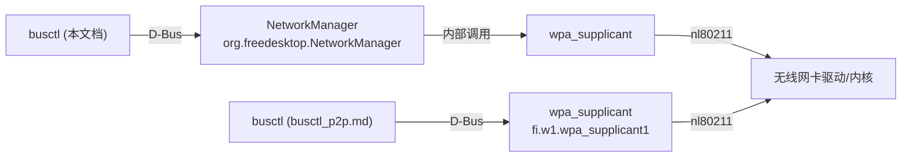
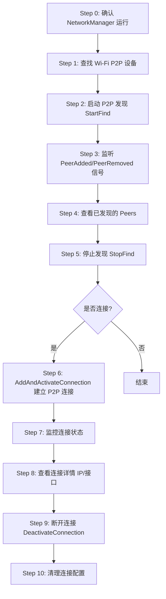

# 使用 busctl 通过 NetworkManager D-Bus API 完成 Wi-Fi P2P 发现与连接

本文档将 `p2p_discovery.py` 脚本的功能转换为 `busctl` 命令行操作，便于调试和理解 NetworkManager 的 Wi-Fi P2P (Wi-Fi Direct) D-Bus API。

> **对应关系**：`p2p_discovery.py` → `busctl` + NetworkManager D-Bus API

---

## 前置知识

### 关键 D-Bus 坐标

| 项目 | 值 |
|------|------|
| **服务名 (Bus Name)** | `org.freedesktop.NetworkManager` |
| **主对象路径** | `/org/freedesktop/NetworkManager` |
| **NM 主接口** | `org.freedesktop.NetworkManager` |
| **设备接口** | `org.freedesktop.NetworkManager.Device` |
| **Wi-Fi P2P 设备接口** | `org.freedesktop.NetworkManager.Device.WifiP2P` |
| **P2P Peer 接口** | `org.freedesktop.NetworkManager.WifiP2PPeer` |
| **活动连接接口** | `org.freedesktop.NetworkManager.Connection.Active` |
| **Settings 接口** | `org.freedesktop.NetworkManager.Settings` |
| **Settings.Connection 接口** | `org.freedesktop.NetworkManager.Settings.Connection` |
| **IP4Config 接口** | `org.freedesktop.NetworkManager.IP4Config` |
| **Properties 接口** | `org.freedesktop.DBus.Properties` |

### NM 设备类型常量

| 类型值 | 含义 |
|--------|------|
| 1 | Ethernet |
| 2 | Wi-Fi |
| 14 | Generic |
| 30 | **Wi-Fi P2P** |

### 与 wpa_supplicant 方式的区别



- **本文档**：通过 NetworkManager D-Bus API（更高层，自动管理连接配置、IP 地址等）
- **busctl_p2p.md**：直接调用 wpa_supplicant D-Bus API（更底层，控制更精细）

---

## 全流程概览



---

## Step 0: 确认 NetworkManager 正在运行

```bash
# Check if NetworkManager is registered on D-Bus
sudo busctl status org.freedesktop.NetworkManager
```

查看 NetworkManager 暴露的完整对象树：

```bash
sudo busctl tree org.freedesktop.NetworkManager
```

输出示例：
```
└─/org/freedesktop
  └─/org/freedesktop/NetworkManager
    ├─/org/freedesktop/NetworkManager/ActiveConnection
    ├─/org/freedesktop/NetworkManager/Devices
    │ ├─/org/freedesktop/NetworkManager/Devices/1
    │ ├─/org/freedesktop/NetworkManager/Devices/2
    │ └─/org/freedesktop/NetworkManager/Devices/3
    ├─/org/freedesktop/NetworkManager/IP4Config
    ├─/org/freedesktop/NetworkManager/IP6Config
    └─/org/freedesktop/NetworkManager/Settings
```

检查 NM 版本（需要 >= 1.16 才支持 P2P）：

```bash
sudo busctl get-property org.freedesktop.NetworkManager \
  /org/freedesktop/NetworkManager \
  org.freedesktop.NetworkManager \
  Version
```

---

## Step 1: 查找 Wi-Fi P2P 设备

> **对应 Python 函数**：`find_p2p_device()` 和 `find_p2p_device_from_wifi()`

### 1.1 获取所有设备列表

```bash
# Equivalent to: nm.GetDevices()
sudo busctl call org.freedesktop.NetworkManager \
  /org/freedesktop/NetworkManager \
  org.freedesktop.NetworkManager \
  GetDevices
```

返回示例：
```
ao 3 "/org/freedesktop/NetworkManager/Devices/1" "/org/freedesktop/NetworkManager/Devices/2" "/org/freedesktop/NetworkManager/Devices/3"
```

### 1.2 检查每个设备的类型

遍历设备，查找 `DeviceType == 30`（Wi-Fi P2P）：

```bash
# Check device type (30 = Wi-Fi P2P)
sudo busctl get-property org.freedesktop.NetworkManager \
  /org/freedesktop/NetworkManager/Devices/1 \
  org.freedesktop.NetworkManager.Device \
  DeviceType
```

返回示例：
```
u 30
```

### 1.3 获取设备接口名

```bash
# Get the interface name of the device
sudo busctl get-property org.freedesktop.NetworkManager \
  /org/freedesktop/NetworkManager/Devices/1 \
  org.freedesktop.NetworkManager.Device \
  Interface
```

返回示例：
```
s "p2p-dev-wlan0"
```

### 1.4 用 introspect 一次性查看设备信息

```bash
sudo busctl introspect org.freedesktop.NetworkManager \
  /org/freedesktop/NetworkManager/Devices/1
```

### 1.5 快速查找脚本（一行命令）

```bash
# Find all P2P devices: list devices, then check each one's type
for dev in $(sudo busctl call org.freedesktop.NetworkManager \
  /org/freedesktop/NetworkManager \
  org.freedesktop.NetworkManager \
  GetDevices | grep -oP '"/[^"]+' | tr -d '"'); do
  TYPE=$(sudo busctl get-property org.freedesktop.NetworkManager \
    "$dev" org.freedesktop.NetworkManager.Device DeviceType | awk '{print $2}')
  IFACE=$(sudo busctl get-property org.freedesktop.NetworkManager \
    "$dev" org.freedesktop.NetworkManager.Device Interface | awk '{print $2}' | tr -d '"')
  echo "Device: $dev  Type: $TYPE  Interface: $IFACE"
done
```

> 记住 P2P 设备的对象路径（`DeviceType == 30`），后续用 `$P2P_DEV` 表示，
> 例如 `/org/freedesktop/NetworkManager/Devices/3`。

### 1.6 备选方案：从 Wi-Fi 设备获取 P2P 伴随设备

> **对应 Python 函数**：`find_p2p_device_from_wifi()`

某些 NM 版本中，P2P 设备作为 Wi-Fi 设备的伴随设备暴露：

```bash
# First find a Wi-Fi device (DeviceType == 2)
# Then check if it has a P2PDevice property
sudo busctl get-property org.freedesktop.NetworkManager \
  /org/freedesktop/NetworkManager/Devices/2 \
  org.freedesktop.NetworkManager.Device.Wireless \
  P2PDevice
```

---

## Step 2: 启动 P2P 发现（StartFind）

> **对应 Python 方法**：`P2PDiscovery.start_discovery()` 中的 `p2p_iface.StartFind(options)`

`StartFind` 方法接受一个 `a{sv}` 字典参数，支持 `timeout` 选项：

```bash
# Start P2P peer discovery with 15 second timeout
# Method signature: StartFind(a{sv} options)
sudo busctl call org.freedesktop.NetworkManager \
  /org/freedesktop/NetworkManager/Devices/3 \
  org.freedesktop.NetworkManager.Device.WifiP2P \
  StartFind \
  "a{sv}" 1 "timeout" v "i" 15
```

### 不指定超时（由 NM 管理）

```bash
sudo busctl call org.freedesktop.NetworkManager \
  /org/freedesktop/NetworkManager/Devices/3 \
  org.freedesktop.NetworkManager.Device.WifiP2P \
  StartFind \
  "a{sv}" 1 "timeout" v "i" 0
```

### 不带任何参数

```bash
sudo busctl call org.freedesktop.NetworkManager \
  /org/freedesktop/NetworkManager/Devices/3 \
  org.freedesktop.NetworkManager.Device.WifiP2P \
  StartFind \
  "a{sv}" 0
```

**常见错误排查**：

| 错误 | 原因 | 解决方案 |
|------|------|---------|
| `Permission denied` | 未以 root 运行 | 使用 `sudo` |
| `UnknownMethod` | 设备不支持 P2P | 确认 DeviceType == 30 |
| `NotAllowed` | NM 未管理该设备 | 检查 NM 配置 |

---

## Step 3: 监听 PeerAdded / PeerRemoved 信号

> **对应 Python 方法**：`P2PDiscovery._on_peer_added()` 和 `_on_peer_removed()`

在**另一个终端**中运行，实时监听发现事件：

```bash
# Monitor all NetworkManager signals (including PeerAdded/PeerRemoved)
sudo busctl monitor org.freedesktop.NetworkManager
```

当发现新 Peer 时，会看到类似输出：

```
‣ Type=signal  Endian=l  Flags=1  Version=1
  Path=/org/freedesktop/NetworkManager/Devices/3
  Interface=org.freedesktop.NetworkManager.Device.WifiP2P
  Member=PeerAdded
  OBJECT_PATH "/org/freedesktop/NetworkManager/WifiP2PPeer/1"
```

当 Peer 丢失时：

```
‣ Type=signal  Endian=l  Flags=1  Version=1
  Path=/org/freedesktop/NetworkManager/Devices/3
  Interface=org.freedesktop.NetworkManager.Device.WifiP2P
  Member=PeerRemoved
  OBJECT_PATH "/org/freedesktop/NetworkManager/WifiP2PPeer/1"
```

### 过滤只看 P2P 相关信号

```bash
# Filter for WifiP2P interface signals only
sudo busctl monitor org.freedesktop.NetworkManager \
  --match="interface='org.freedesktop.NetworkManager.Device.WifiP2P'"
```

---

## Step 4: 查看已发现的 Peers

> **对应 Python 方法**：`P2PDiscovery._get_peer_info()`

### 4.1 列出所有已发现的 Peers

```bash
# Get the list of discovered peers
# Equivalent to: get_property(bus, p2p_dev_path, NM_WIFI_P2P_IFACE, "Peers")
sudo busctl get-property org.freedesktop.NetworkManager \
  /org/freedesktop/NetworkManager/Devices/3 \
  org.freedesktop.NetworkManager.Device.WifiP2P \
  Peers
```

返回示例：
```
ao 2 "/org/freedesktop/NetworkManager/WifiP2PPeer/1" "/org/freedesktop/NetworkManager/WifiP2PPeer/2"
```

### 4.2 查看 Peer 详细信息

```bash
# Peer name
sudo busctl get-property org.freedesktop.NetworkManager \
  /org/freedesktop/NetworkManager/WifiP2PPeer/1 \
  org.freedesktop.NetworkManager.WifiP2PPeer \
  Name

# Peer MAC address (HWAddress)
sudo busctl get-property org.freedesktop.NetworkManager \
  /org/freedesktop/NetworkManager/WifiP2PPeer/1 \
  org.freedesktop.NetworkManager.WifiP2PPeer \
  HWAddress

# Manufacturer
sudo busctl get-property org.freedesktop.NetworkManager \
  /org/freedesktop/NetworkManager/WifiP2PPeer/1 \
  org.freedesktop.NetworkManager.WifiP2PPeer \
  Manufacturer

# Model
sudo busctl get-property org.freedesktop.NetworkManager \
  /org/freedesktop/NetworkManager/WifiP2PPeer/1 \
  org.freedesktop.NetworkManager.WifiP2PPeer \
  Model

# Model Number
sudo busctl get-property org.freedesktop.NetworkManager \
  /org/freedesktop/NetworkManager/WifiP2PPeer/1 \
  org.freedesktop.NetworkManager.WifiP2PPeer \
  ModelNumber

# Serial
sudo busctl get-property org.freedesktop.NetworkManager \
  /org/freedesktop/NetworkManager/WifiP2PPeer/1 \
  org.freedesktop.NetworkManager.WifiP2PPeer \
  Serial

# Flags
sudo busctl get-property org.freedesktop.NetworkManager \
  /org/freedesktop/NetworkManager/WifiP2PPeer/1 \
  org.freedesktop.NetworkManager.WifiP2PPeer \
  Flags

# WfdIEs (Wi-Fi Display Information Elements)
sudo busctl get-property org.freedesktop.NetworkManager \
  /org/freedesktop/NetworkManager/WifiP2PPeer/1 \
  org.freedesktop.NetworkManager.WifiP2PPeer \
  WfdIEs
```

### 4.3 用 introspect 一次性查看 Peer 所有属性

```bash
sudo busctl introspect org.freedesktop.NetworkManager \
  /org/freedesktop/NetworkManager/WifiP2PPeer/1
```

### 4.4 Peer 属性参考

| 属性 | 类型 | 说明 |
|------|------|------|
| `Name` | `s` | Peer 设备名称 |
| `HWAddress` | `s` | MAC 地址 |
| `Manufacturer` | `s` | 厂商名 |
| `Model` | `s` | 型号名 |
| `ModelNumber` | `s` | 型号编号 |
| `Serial` | `s` | 序列号 |
| `Flags` | `u` | 标志位 |
| `WfdIEs` | `ay` | Wi-Fi Display IE 数据 |

---

## Step 5: 停止 P2P 发现（StopFind）

> **对应 Python 代码**：`p2p_iface.StopFind()`

```bash
sudo busctl call org.freedesktop.NetworkManager \
  /org/freedesktop/NetworkManager/Devices/3 \
  org.freedesktop.NetworkManager.Device.WifiP2P \
  StopFind
```

---

## Step 6: 建立 P2P 连接（AddAndActivateConnection）

> **对应 Python 函数**：`create_p2p_connection()`

这是最核心的步骤。使用 `AddAndActivateConnection` 方法一步完成：创建连接配置 + 激活连接。

### 方法签名

```
AddAndActivateConnection(
    a{sa{sv}} connection,    # Connection settings
    o device,                # Device object path
    o specific_object        # Specific object (peer path)
) → (o settings_path, o active_connection_path)
```

### 6.1 完整命令

```bash
# AddAndActivateConnection to establish P2P group
# Replace peer MAC "AA:BB:CC:DD:EE:FF" with actual peer's HWAddress
# Replace device/peer paths with actual paths
sudo busctl call org.freedesktop.NetworkManager \
  /org/freedesktop/NetworkManager \
  org.freedesktop.NetworkManager \
  AddAndActivateConnection \
  "a{sa{sv}}oo" \
  4 \
    "connection" 3 \
      "id" v "s" "wifi-p2p-connection" \
      "type" v "s" "wifi-p2p" \
      "autoconnect" v "b" false \
    "wifi-p2p" 1 \
      "peer" v "s" "AA:BB:CC:DD:EE:FF" \
    "ipv4" 1 \
      "method" v "s" "auto" \
    "ipv6" 1 \
      "method" v "s" "auto" \
  "/org/freedesktop/NetworkManager/Devices/3" \
  "/org/freedesktop/NetworkManager/WifiP2PPeer/1"
```

返回示例：
```
oo "/org/freedesktop/NetworkManager/Settings/5" "/org/freedesktop/NetworkManager/ActiveConnection/3"
```

- 第一个路径：保存的连接配置路径
- 第二个路径：活动连接路径

### 6.2 参数详解

`a{sa{sv}}` 是一个嵌套字典，外层 key 是 section 名，内层是该 section 的属性：

| Section | Key | 类型 | 值 | 说明 |
|---------|-----|------|-----|------|
| `connection` | `id` | `s` | `"wifi-p2p-connection"` | 连接配置名称 |
| `connection` | `type` | `s` | `"wifi-p2p"` | 连接类型 |
| `connection` | `autoconnect` | `b` | `false` | 不自动连接 |
| `wifi-p2p` | `peer` | `s` | `"AA:BB:CC:DD:EE:FF"` | 目标 Peer 的 MAC 地址 |
| `ipv4` | `method` | `s` | `"auto"` | 自动获取 IPv4 (DHCP) |
| `ipv6` | `method` | `s` | `"auto"` | 自动获取 IPv6 |

### 6.3 使用 shared 模式（作为 GO 提供 DHCP）

如果希望本机作为 GO 并自动分配 IP：

```bash
sudo busctl call org.freedesktop.NetworkManager \
  /org/freedesktop/NetworkManager \
  org.freedesktop.NetworkManager \
  AddAndActivateConnection \
  "a{sa{sv}}oo" \
  4 \
    "connection" 3 \
      "id" v "s" "wifi-p2p-connection" \
      "type" v "s" "wifi-p2p" \
      "autoconnect" v "b" false \
    "wifi-p2p" 1 \
      "peer" v "s" "AA:BB:CC:DD:EE:FF" \
    "ipv4" 1 \
      "method" v "s" "shared" \
    "ipv6" 1 \
      "method" v "s" "auto" \
  "/org/freedesktop/NetworkManager/Devices/3" \
  "/org/freedesktop/NetworkManager/WifiP2PPeer/1"
```

---

## Step 7: 监控连接状态

> **对应 Python 函数**：`_monitor_connection_state()`

### 7.1 查看当前连接状态

```bash
# Get active connection state
# States: 0=Unknown, 1=Activating, 2=Activated, 3=Deactivating, 4=Deactivated
sudo busctl get-property org.freedesktop.NetworkManager \
  /org/freedesktop/NetworkManager/ActiveConnection/3 \
  org.freedesktop.NetworkManager.Connection.Active \
  State
```

返回示例：
```
u 2
```

### 连接状态值参考

| 值 | 名称 | 说明 |
|----|------|------|
| 0 | Unknown | 未知状态 |
| 1 | Activating | 正在激活 |
| 2 | **Activated** | **已激活（连接成功）** |
| 3 | Deactivating | 正在停用 |
| 4 | Deactivated | 已停用 |

### 7.2 实时监听状态变化

在另一个终端中：

```bash
# Monitor property changes on the active connection
sudo busctl monitor org.freedesktop.NetworkManager \
  --match="path='/org/freedesktop/NetworkManager/ActiveConnection/3',interface='org.freedesktop.DBus.Properties',member='PropertiesChanged'"
```

会看到类似输出：

```
‣ Type=signal
  Path=/org/freedesktop/NetworkManager/ActiveConnection/3
  Interface=org.freedesktop.DBus.Properties
  Member=PropertiesChanged
  STRING "org.freedesktop.NetworkManager.Connection.Active"
  ARRAY "{sv}" { "State" VARIANT uint32 2 }
  ARRAY "s" {}
```

### 7.3 轮询方式检查状态（简单脚本）

```bash
#!/bin/bash
# Poll connection state until activated or timeout
ACTIVE_CONN="/org/freedesktop/NetworkManager/ActiveConnection/3"
TIMEOUT=30
ELAPSED=0

while [ $ELAPSED -lt $TIMEOUT ]; do
  STATE=$(sudo busctl get-property org.freedesktop.NetworkManager \
    "$ACTIVE_CONN" \
    org.freedesktop.NetworkManager.Connection.Active \
    State 2>/dev/null | awk '{print $2}')

  case $STATE in
    2) echo "[+] Connected! (Activated)"; break ;;
    4) echo "[!] Connection deactivated."; break ;;
    1) echo "[*] Activating... ($ELAPSED s)" ;;
    *) echo "[?] State: $STATE ($ELAPSED s)" ;;
  esac

  sleep 1
  ELAPSED=$((ELAPSED + 1))
done

if [ $ELAPSED -ge $TIMEOUT ]; then
  echo "[!] Timeout waiting for connection."
fi
```

---

## Step 8: 查看连接详情

> **对应 Python 函数**：`_print_connection_details()`

### 8.1 查看活动连接属性

```bash
# Connection ID
sudo busctl get-property org.freedesktop.NetworkManager \
  /org/freedesktop/NetworkManager/ActiveConnection/3 \
  org.freedesktop.NetworkManager.Connection.Active \
  Id

# Connection UUID
sudo busctl get-property org.freedesktop.NetworkManager \
  /org/freedesktop/NetworkManager/ActiveConnection/3 \
  org.freedesktop.NetworkManager.Connection.Active \
  Uuid

# Connection Type
sudo busctl get-property org.freedesktop.NetworkManager \
  /org/freedesktop/NetworkManager/ActiveConnection/3 \
  org.freedesktop.NetworkManager.Connection.Active \
  Type
```

### 8.2 获取 IPv4 配置

```bash
# Get IP4Config object path
sudo busctl get-property org.freedesktop.NetworkManager \
  /org/freedesktop/NetworkManager/ActiveConnection/3 \
  org.freedesktop.NetworkManager.Connection.Active \
  Ip4Config
```

返回示例：
```
o "/org/freedesktop/NetworkManager/IP4Config/7"
```

```bash
# Get IPv4 address data
sudo busctl get-property org.freedesktop.NetworkManager \
  /org/freedesktop/NetworkManager/IP4Config/7 \
  org.freedesktop.NetworkManager.IP4Config \
  AddressData

# Get gateway
sudo busctl get-property org.freedesktop.NetworkManager \
  /org/freedesktop/NetworkManager/IP4Config/7 \
  org.freedesktop.NetworkManager.IP4Config \
  Gateway
```

### 8.3 获取网络接口名

```bash
# Get devices associated with the active connection
sudo busctl get-property org.freedesktop.NetworkManager \
  /org/freedesktop/NetworkManager/ActiveConnection/3 \
  org.freedesktop.NetworkManager.Connection.Active \
  Devices
```

返回示例：
```
ao 1 "/org/freedesktop/NetworkManager/Devices/4"
```

```bash
# Get the IP interface name (e.g., p2p-wlan0-0)
sudo busctl get-property org.freedesktop.NetworkManager \
  /org/freedesktop/NetworkManager/Devices/4 \
  org.freedesktop.NetworkManager.Device \
  IpInterface
```

返回示例：
```
s "p2p-wlan0-0"
```

### 8.4 用 verbose 模式查看完整信息

```bash
# Verbose output for all active connection properties
sudo busctl get-property --verbose org.freedesktop.NetworkManager \
  /org/freedesktop/NetworkManager/ActiveConnection/3 \
  org.freedesktop.NetworkManager.Connection.Active \
  Id Uuid Type State Ip4Config Devices
```

---

## Step 9: 断开 P2P 连接

> **对应 Python 函数**：`disconnect_p2p()`

```bash
# Deactivate the P2P connection
sudo busctl call org.freedesktop.NetworkManager \
  /org/freedesktop/NetworkManager \
  org.freedesktop.NetworkManager \
  DeactivateConnection \
  "o" "/org/freedesktop/NetworkManager/ActiveConnection/3"
```

---

## Step 10: 清理连接配置

> **对应 Python 函数**：`delete_p2p_connection_profile()`

### 10.1 列出所有保存的连接

```bash
# List all saved connections
sudo busctl call org.freedesktop.NetworkManager \
  /org/freedesktop/NetworkManager/Settings \
  org.freedesktop.NetworkManager.Settings \
  ListConnections
```

返回示例：
```
ao 5 "/org/freedesktop/NetworkManager/Settings/1" ... "/org/freedesktop/NetworkManager/Settings/5"
```

### 10.2 查看连接配置详情

```bash
# Get connection settings (to find the wifi-p2p one)
sudo busctl call org.freedesktop.NetworkManager \
  /org/freedesktop/NetworkManager/Settings/5 \
  org.freedesktop.NetworkManager.Settings.Connection \
  GetSettings
```

### 10.3 删除指定连接配置

```bash
# Delete the P2P connection profile
sudo busctl call org.freedesktop.NetworkManager \
  /org/freedesktop/NetworkManager/Settings/5 \
  org.freedesktop.NetworkManager.Settings.Connection \
  Delete
```

### 10.4 查找并删除脚本（按名称查找）

```bash
#!/bin/bash
# Find and delete a wifi-p2p connection profile by name
TARGET_NAME="wifi-p2p-connection"

CONNECTIONS=$(sudo busctl call org.freedesktop.NetworkManager \
  /org/freedesktop/NetworkManager/Settings \
  org.freedesktop.NetworkManager.Settings \
  ListConnections | grep -oP '"/[^"]+' | tr -d '"')

for conn in $CONNECTIONS; do
  # GetSettings returns the connection settings
  SETTINGS=$(sudo busctl call org.freedesktop.NetworkManager \
    "$conn" \
    org.freedesktop.NetworkManager.Settings.Connection \
    GetSettings 2>/dev/null)

  if echo "$SETTINGS" | grep -q "$TARGET_NAME" && echo "$SETTINGS" | grep -q "wifi-p2p"; then
    echo "Found P2P connection: $conn"
    sudo busctl call org.freedesktop.NetworkManager \
      "$conn" \
      org.freedesktop.NetworkManager.Settings.Connection \
      Delete
    echo "Deleted: $conn"
  fi
done
```

---

## 完整操作示例（一键脚本）

以下脚本实现了 `p2p_discovery.py` 的完整功能：

```bash
#!/bin/bash
# Wi-Fi P2P Discovery and Connection via NetworkManager D-Bus API (busctl)
# Equivalent to p2p_discovery.py
# Requires root privileges

set -e

NM_SERVICE="org.freedesktop.NetworkManager"
NM_PATH="/org/freedesktop/NetworkManager"
NM_IFACE="org.freedesktop.NetworkManager"
NM_DEV_IFACE="org.freedesktop.NetworkManager.Device"
NM_P2P_IFACE="org.freedesktop.NetworkManager.Device.WifiP2P"
NM_PEER_IFACE="org.freedesktop.NetworkManager.WifiP2PPeer"
NM_ACTIVE_IFACE="org.freedesktop.NetworkManager.Connection.Active"
NM_SETTINGS_IFACE="org.freedesktop.NetworkManager.Settings"
NM_SETTINGS_CONN_IFACE="org.freedesktop.NetworkManager.Settings.Connection"

TIMEOUT=${1:-15}
CON_NAME="wifi-p2p-connection"

echo "============================================================"
echo " Wi-Fi P2P Discovery via NetworkManager D-Bus API"
echo "============================================================"

# --- Step 1: Find P2P device ---
echo ""
echo "[*] Step 1: Searching for Wi-Fi P2P device..."

P2P_DEV=""
DEVICES=$(sudo busctl call $NM_SERVICE $NM_PATH $NM_IFACE GetDevices \
  | grep -oP '"/[^"]+' | tr -d '"')

for dev in $DEVICES; do
  TYPE=$(sudo busctl get-property $NM_SERVICE "$dev" $NM_DEV_IFACE DeviceType \
    | awk '{print $2}')
  if [ "$TYPE" = "30" ]; then
    IFACE_NAME=$(sudo busctl get-property $NM_SERVICE "$dev" $NM_DEV_IFACE Interface \
      | awk '{print $2}' | tr -d '"')
    echo "[+] Found Wi-Fi P2P device: $IFACE_NAME ($dev)"
    P2P_DEV="$dev"
    break
  fi
done

if [ -z "$P2P_DEV" ]; then
  echo "[!] No Wi-Fi P2P device found!"
  echo "[!] Listing all devices for debugging:"
  for dev in $DEVICES; do
    TYPE=$(sudo busctl get-property $NM_SERVICE "$dev" $NM_DEV_IFACE DeviceType \
      | awk '{print $2}')
    IFACE_NAME=$(sudo busctl get-property $NM_SERVICE "$dev" $NM_DEV_IFACE Interface \
      | awk '{print $2}' | tr -d '"')
    echo "    Device: $IFACE_NAME, Type: $TYPE, Path: $dev"
  done
  exit 1
fi

# --- Step 2: Start P2P discovery ---
echo ""
echo "[*] Step 2: Starting P2P peer discovery (timeout: ${TIMEOUT}s)..."
echo "------------------------------------------------------------"

sudo busctl call $NM_SERVICE "$P2P_DEV" $NM_P2P_IFACE \
  StartFind "a{sv}" 1 "timeout" v "i" $TIMEOUT

echo "[*] P2P Find started on $P2P_DEV"

# --- Step 3: Check existing peers and wait ---
echo ""
echo "[*] Step 3: Checking for existing peers..."

# Check already-known peers
PEERS=$(sudo busctl get-property $NM_SERVICE "$P2P_DEV" $NM_P2P_IFACE Peers 2>/dev/null \
  | grep -oP '"/[^"]+' | tr -d '"' || true)

for peer in $PEERS; do
  NAME=$(sudo busctl get-property $NM_SERVICE "$peer" $NM_PEER_IFACE Name 2>/dev/null \
    | awk '{print $2}' | tr -d '"' || echo "Unknown")
  MAC=$(sudo busctl get-property $NM_SERVICE "$peer" $NM_PEER_IFACE HWAddress 2>/dev/null \
    | awk '{print $2}' | tr -d '"' || echo "N/A")
  MFR=$(sudo busctl get-property $NM_SERVICE "$peer" $NM_PEER_IFACE Manufacturer 2>/dev/null \
    | awk '{print $2}' | tr -d '"' || echo "N/A")
  MODEL=$(sudo busctl get-property $NM_SERVICE "$peer" $NM_PEER_IFACE Model 2>/dev/null \
    | awk '{print $2}' | tr -d '"' || echo "N/A")
  echo "  [FOUND] Peer: $NAME"
  echo "          HWAddress: $MAC"
  echo "          Manufacturer: $MFR"
  echo "          Model: $MODEL"
  echo "          Path: $peer"
  echo ""
done

# Wait for discovery to complete
echo "[*] Waiting ${TIMEOUT}s for discovery..."
sleep $TIMEOUT

# --- Step 4: Final peer list ---
echo ""
echo "[*] Step 4: Discovery complete. Collecting results..."

sudo busctl call $NM_SERVICE "$P2P_DEV" $NM_P2P_IFACE StopFind 2>/dev/null || true

PEERS=$(sudo busctl get-property $NM_SERVICE "$P2P_DEV" $NM_P2P_IFACE Peers 2>/dev/null \
  | grep -oP '"/[^"]+' | tr -d '"' || true)

PEER_COUNT=$(echo "$PEERS" | grep -c '/' 2>/dev/null || echo 0)
echo "------------------------------------------------------------"
echo "[*] Found $PEER_COUNT peer(s)."

echo ""
echo "============================================================"
echo " Discovered Peers Summary"
echo "============================================================"

INDEX=1
FIRST_PEER=""
for peer in $PEERS; do
  NAME=$(sudo busctl get-property $NM_SERVICE "$peer" $NM_PEER_IFACE Name 2>/dev/null \
    | awk '{print $2}' | tr -d '"' || echo "Unknown")
  MAC=$(sudo busctl get-property $NM_SERVICE "$peer" $NM_PEER_IFACE HWAddress 2>/dev/null \
    | awk '{print $2}' | tr -d '"' || echo "N/A")
  MFR=$(sudo busctl get-property $NM_SERVICE "$peer" $NM_PEER_IFACE Manufacturer 2>/dev/null \
    | awk '{print $2}' | tr -d '"' || echo "")
  MODEL=$(sudo busctl get-property $NM_SERVICE "$peer" $NM_PEER_IFACE Model 2>/dev/null \
    | awk '{print $2}' | tr -d '"' || echo "")
  echo "  [$INDEX] Name: $NAME"
  echo "      MAC:  $MAC"
  echo "      Model: $MFR $MODEL"
  echo ""

  if [ -z "$FIRST_PEER" ]; then
    FIRST_PEER="$peer"
    FIRST_PEER_MAC="$MAC"
    FIRST_PEER_NAME="$NAME"
  fi
  INDEX=$((INDEX + 1))
done

echo "============================================================"
echo ""
echo "[*] To connect to the first peer, run:"
echo "    sudo busctl call $NM_SERVICE \\"
echo "      $NM_PATH \\"
echo "      $NM_IFACE \\"
echo "      AddAndActivateConnection \\"
echo "      'a{sa{sv}}oo' \\"
echo "      4 \\"
echo "        'connection' 3 'id' v 's' '$CON_NAME' 'type' v 's' 'wifi-p2p' 'autoconnect' v 'b' false \\"
echo "        'wifi-p2p' 1 'peer' v 's' '$FIRST_PEER_MAC' \\"
echo "        'ipv4' 1 'method' v 's' 'auto' \\"
echo "        'ipv6' 1 'method' v 's' 'auto' \\"
echo "      '$P2P_DEV' \\"
echo "      '$FIRST_PEER'"
```

---

## 附录 A: Python 函数 → busctl 命令对照表

| Python 函数 | busctl 命令 | 说明 |
|-------------|-------------|------|
| `get_system_bus()` | N/A | busctl 自动使用 system bus |
| `get_nm_proxy(bus)` | N/A | busctl 直接指定服务名 |
| `get_property(bus, path, iface, prop)` | `busctl get-property <service> <path> <iface> <prop>` | 获取单个属性 |
| `get_all_properties(bus, path, iface)` | `busctl introspect <service> <path>` | 查看所有属性 |
| `find_p2p_device(bus)` | `busctl call ... GetDevices` + `busctl get-property ... DeviceType` | 遍历设备找 type=30 |
| `find_p2p_device_from_wifi(bus)` | `busctl get-property ... P2PDevice` | 从 Wi-Fi 设备获取 P2P 伴随设备 |
| `P2PDiscovery.start_discovery()` | `busctl call ... StartFind` | 启动 P2P 发现 |
| `p2p_iface.StopFind()` | `busctl call ... StopFind` | 停止 P2P 发现 |
| `_on_peer_added()` / `_on_peer_removed()` | `busctl monitor ...` | 监听信号 |
| `_get_peer_info(peer_path)` | `busctl get-property ... Name/HWAddress/...` | 获取 Peer 信息 |
| `create_p2p_connection(...)` | `busctl call ... AddAndActivateConnection` | 创建并激活 P2P 连接 |
| `_monitor_connection_state(...)` | `busctl get-property ... State` / `busctl monitor ...` | 监控连接状态 |
| `_print_connection_details(...)` | `busctl get-property ... Id/Uuid/Ip4Config/...` | 打印连接详情 |
| `disconnect_p2p(...)` | `busctl call ... DeactivateConnection` | 断开连接 |
| `delete_p2p_connection_profile(...)` | `busctl call ... ListConnections` + `Delete` | 删除连接配置 |

---

## 附录 B: busctl 常用调试技巧

### 查看 NM 所有 P2P 相关接口

```bash
# Introspect the P2P device to see all available methods/properties/signals
sudo busctl introspect org.freedesktop.NetworkManager \
  /org/freedesktop/NetworkManager/Devices/3 \
  org.freedesktop.NetworkManager.Device.WifiP2P
```

输出示例：
```
NAME                  TYPE      SIGNATURE  RESULT/VALUE  FLAGS
.StartFind            method    a{sv}      -             -
.StopFind             method    -          -             -
.Peers                property  ao         -             emits-change
.PeerAdded            signal    o          -             -
.PeerRemoved          signal    o          -             -
```

### 使用 JSON 格式输出（便于解析）

```bash
# JSON output for properties
sudo busctl get-property --json=pretty org.freedesktop.NetworkManager \
  /org/freedesktop/NetworkManager/WifiP2PPeer/1 \
  org.freedesktop.NetworkManager.WifiP2PPeer \
  Name HWAddress Manufacturer Model
```

### 使用 verbose 模式查看详细类型信息

```bash
sudo busctl get-property --verbose org.freedesktop.NetworkManager \
  /org/freedesktop/NetworkManager/WifiP2PPeer/1 \
  org.freedesktop.NetworkManager.WifiP2PPeer \
  Name HWAddress
```

### 实时监控所有 NM 状态变化

```bash
# Monitor everything from NetworkManager
sudo busctl monitor org.freedesktop.NetworkManager

# Filter for specific signal types
sudo busctl monitor org.freedesktop.NetworkManager \
  --match="type='signal',member='PeerAdded'"

sudo busctl monitor org.freedesktop.NetworkManager \
  --match="type='signal',member='PropertiesChanged'"
```

---

## 附录 C: 故障排查

### 常见错误及解决方案

| 错误信息 | 原因 | 解决方案 |
|---------|------|---------|
| `org.freedesktop.DBus.Error.ServiceUnknown` | NetworkManager 未运行 | `sudo systemctl start NetworkManager` |
| `org.freedesktop.NetworkManager.PermissionDenied` | 权限不足 | 使用 `sudo` 运行 |
| `org.freedesktop.NetworkManager.UnknownDevice` | 设备路径不存在 | 重新执行 `GetDevices` 获取正确路径 |
| `No Wi-Fi P2P device found` | 网卡不支持 P2P 或 NM 未管理 | 检查网卡驱动和 NM 配置 |
| `StartFind` 无响应 | P2P 设备被其他程序占用 | 检查 wpa_supplicant 是否独立运行 |
| `AddAndActivateConnection` 失败 | 参数格式错误 | 仔细检查 `a{sa{sv}}` 嵌套字典格式 |

### 检查 NetworkManager 日志

```bash
# View NM logs in real-time
sudo journalctl -u NetworkManager -f

# Increase NM log level for debugging
sudo busctl set-property org.freedesktop.NetworkManager \
  /org/freedesktop/NetworkManager \
  org.freedesktop.NetworkManager \
  LogLevel s "DEBUG"

# Reset log level
sudo busctl set-property org.freedesktop.NetworkManager \
  /org/freedesktop/NetworkManager \
  org.freedesktop.NetworkManager \
  LogLevel s "INFO"
```

### 验证 P2P 支持

```bash
# Check if the Wi-Fi driver supports P2P
iw phy | grep -A 5 "Supported interface modes" | grep "P2P"

# Check NM device capabilities
sudo busctl get-property org.freedesktop.NetworkManager \
  /org/freedesktop/NetworkManager/Devices/3 \
  org.freedesktop.NetworkManager.Device \
  Capabilities
```

---

## 附录 D: AddAndActivateConnection 参数格式详解

`busctl` 中 `a{sa{sv}}` 嵌套字典的格式是最容易出错的部分，这里详细说明：

### 格式结构

```
a{sa{sv}}     # 外层：string → dict 的字典
  <N>         # 外层字典的条目数
    "<section>" <M>    # section 名称 + 该 section 的属性数
      "<key>" v "<type>" <value>   # 属性名 + variant(类型 + 值)
      ...
    ...
```

### 逐行解析示例

```bash
"a{sa{sv}}oo"     # 签名：嵌套字典 + 两个 object path
4                  # 外层字典有 4 个 section
  "connection" 3   # "connection" section 有 3 个属性
    "id" v "s" "wifi-p2p-connection"       # id = string "wifi-p2p-connection"
    "type" v "s" "wifi-p2p"                # type = string "wifi-p2p"
    "autoconnect" v "b" false              # autoconnect = boolean false
  "wifi-p2p" 1    # "wifi-p2p" section 有 1 个属性
    "peer" v "s" "AA:BB:CC:DD:EE:FF"      # peer = string (MAC address)
  "ipv4" 1        # "ipv4" section 有 1 个属性
    "method" v "s" "auto"                  # method = string "auto"
  "ipv6" 1        # "ipv6" section 有 1 个属性
    "method" v "s" "auto"                  # method = string "auto"
"/org/freedesktop/NetworkManager/Devices/3"      # device object path
"/org/freedesktop/NetworkManager/WifiP2PPeer/1"  # peer (specific_object) path
```

> **提示**：`v` 表示 variant 类型，后面需要跟实际类型签名和值。例如 `v "s" "hello"` 表示一个包含字符串 `"hello"` 的 variant。
