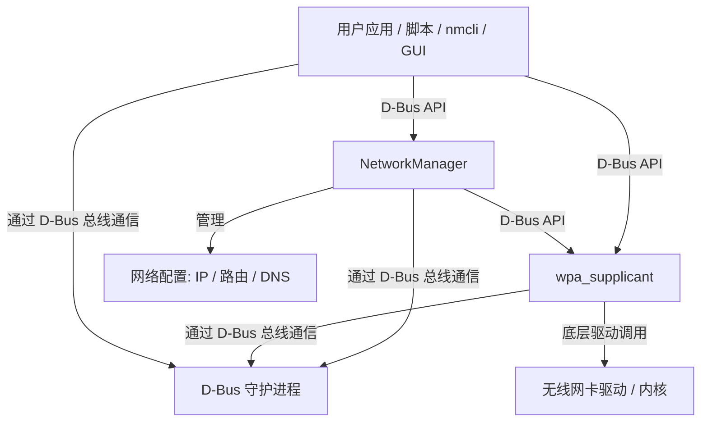
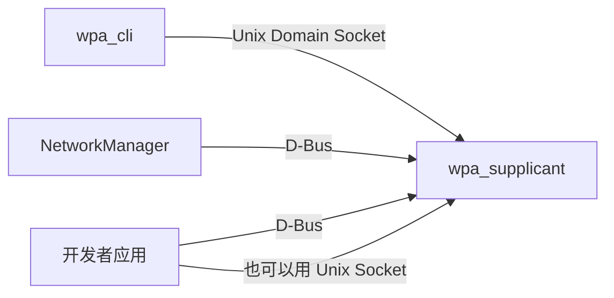

# Linux网络工具杂谈

## 关键概念

- NetworkManager
- wpa_cli
- wpa_supplicant
- dbus
- dbus api
- 无线网卡

## 关系图

- 用户编程应用 → NetworkManager → wpa_supplicant → 网卡

- wpa_cli与NetworkManager对wpa_supplicant通信机制的区别

## 参考

NetworkManager官方发布页：https://networkmanager.dev/tags/release/(里面下载的是对应版本的程序源码)

wpa_supplicant官方发布页：https://www.linuxfromscratch.org/blfs/view/11.1/basicnet/wpa_supplicant.html(里面下载是源码)

D-bus官网：https://www.freedesktop.org/wiki/Software/dbus/

D-bus api reference：https://people.freedesktop.org/~lkundrak/nm-dbus-api/spec.html