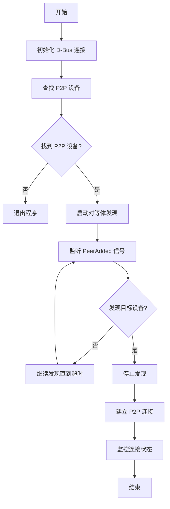

# Wi-Fi P2P Discovery & Connection Tool

一个基于 NetworkManager D-Bus API 的 Wi-Fi P2P（Wi-Fi Direct）设备发现和连接工具。

## 📋 项目概述

本项目提供了一个完整的 Wi-Fi P2P 解决方案，用于在 Linux 系统上通过 NetworkManager 发现和连接 P2P 设备。通过 D-Bus 接口与 NetworkManager 通信，实现了对等设备的自动发现、信息获取和连接建立。

## ✨ 主要功能

- **P2P 设备检测**：自动查找系统中可用的 Wi-Fi P2P 设备
- **对等体发现**：扫描并发现周围的 P2P 设备（Wi-Fi Direct 设备）
- **目标设备筛选**：支持按 MAC 地址筛选特定的目标设备
- **自动连接**：发现目标设备后自动建立 P2P 连接
- **实时信号监控**：监听设备添加/移除信号，实时更新设备列表

## 🏗️ 技术架构

### 核心技术栈

- **D-Bus**：Linux 进程间通信机制
- **NetworkManager**：Linux 网络管理服务
- **GLib**：事件循环和信号处理
- **Python 3**：主要开发语言

### D-Bus 接口

项目使用以下 NetworkManager D-Bus 接口：

| 接口名称 | 用途 |
|---------|------|
| `org.freedesktop.NetworkManager` | 主 NetworkManager 接口 |
| `org.freedesktop.NetworkManager.Device` | 设备通用接口 |
| `org.freedesktop.NetworkManager.Device.WifiP2P` | P2P 设备专用接口 |
| `org.freedesktop.NetworkManager.WifiP2PPeer` | P2P 对等体接口 |
| `org.freedesktop.DBus.Properties` | 属性访问接口 |

## 📁 项目结构

```
Dbus_For_p2p/
├── NetworkManager_p2p.py    # 主程序文件
├── readme.md                 # 项目说明文档
├── pipeline.md              # 开发流程文档
├── docs/                    # 文档目录
│   ├── readme.md            # 文档索引
│   ├── networkManager_dbus.md  # NetworkManager D-Bus 文档
│   ├── wpa_supplicant_dbus_api.md  # WPA _supplicant D-Bus API
│   ├── busctl_p2p.md        # busctl 工具使用指南
│   ├── succeed_network.md   # 成功案例记录
│   └── *.man                # 相关手册页
└── reference/               # 参考代码
    └── p2p_discovery.py     # P2P 发现参考实现
```

## 🔧 核心组件

### 1. 辅助函数模块

```python
get_system_bus()           # 获取 D-Bus 系统总线
get_nm_proxy()            # 获取 NetworkManager 代理对象
get_property()            # 获取单个 D-Bus 属性
get_all_properties()      # 获取所有 D-Bus 属性
find_p2p_device()         # 查找 P2P 设备
```

### 2. P2PDiscovery 类

核心的发现引擎，负责：

- 订阅 `PeerAdded` 和 `PeerRemoved` 信号
- 启动和停止 P2P 发现过程
- 管理已发现的对等体列表
- 支持目标设备筛选

**主要方法：**

```python
start_discovery()         # 启动发现过程
_on_peer_added()         # 对等体添加回调
_on_peer_removed()       # 对等体移除回调
_get_peer_info()         # 获取对等体详细信息
```

### 3. 连接建立模块

```python
create_p2p_connection()   # 创建并激活 P2P 连接
```

该函数：
- 构建连接配置（包括 IPv4/IPv6 设置）
- 调用 `AddAndActivateConnection` 一步完成配置创建和连接激活
- 支持 WPS 配置（PBC 或 PIN 模式）

## 🚀 使用方法

### 环境要求

- **操作系统**：Linux（支持 NetworkManager）
- **Python 版本**：Python 3.6+
- **依赖包**：
  ```bash
  pip install dbus-python pygobject3
  ```
- **权限**：需要 root 权限运行

### 运行步骤

1. **确保 NetworkManager 正在运行**
   ```bash
   sudo systemctl start NetworkManager
   ```

2. **检查 Wi-Fi 适配器是否支持 P2P**
   ```bash
   nmcli device status
   ```

3. **运行程序**
   ```bash
   sudo python3 NetworkManager_p2p.py
   ```

### 自定义配置

修改 `main()` 函数中的参数：

```python
def main():
    # 设置目标对等体的 MAC 地址
    target_peer_address = "62:4B:7C:9E:06:7E"
    
    # 其他配置...
```

## 📊 工作流程



## 🔍 输出示例

程序运行时的典型输出：

```
[+] Found Wi-Fi P2P device: p2p-dev-wlan0 (/org/freedesktop/NetworkManager/Devices/5)
[+] Using P2P device at /org/freedesktop/NetworkManager/Devices/5

[*] Starting P2P peer discovery (timeout: 600s)...
------------------------------------------------------------
  [FOUND] Peer: LivingRoom-TV
          HwAddress: 62:4B:7C:9E:06:7E
          Path: /org/freedesktop/NetworkManager/WifiP2P/Peers/...

[*] Target peer 62:4B:7C:9E:06:7E found! Stopping discovery.
[*] P2P Find stopped.
------------------------------------------------------------
[*] Discovery complete. Found 1 peer(s).

[*] Connecting to peer: LivingRoom-TV (62:4B:7C:9E:06:7E)
[*] Calling AddAndActivateConnection...
[+] Connection profile created: /org/freedesktop/NetworkManager/Settings/...
[+] Active connection: /org/freedesktop/NetworkManager/ActiveConnection/...
```

## ⚠️ 注意事项

1. **权限要求**：必须使用 `sudo` 运行，因为需要访问系统 D-Bus
2. **硬件支持**：确保无线网卡支持 P2P 功能
3. **驱动兼容**：某些无线驱动可能不完全支持 P2P
4. **网络管理器**：确保 NetworkManager 正在运行并管理无线设备
5. **WPS 配置**：连接可能需要 WPS 确认（按下设备上的按钮）

## 🛠️ 故障排除

### 常见问题

**问题 1：找不到 P2P 设备**
```bash
# 检查设备状态
nmcli device status

# 查看设备详情
nmcli device show wlan0
```

**问题 2：权限被拒绝**
```bash
# 确保使用 sudo 运行
sudo python3 NetworkManager_p2p.py
```

**问题 3：发现超时**
- 增加 `timeout` 参数值
- 确保目标设备在范围内且可发现

**问题 4：连接失败**
- 检查 WPS 配置是否正确
- 确认目标设备支持 P2P 连接
- 查看 NetworkManager 日志：
  ```bash
  sudo journalctl -u NetworkManager -f
  ```

## 📚 相关文档

- [NetworkManager D-Bus API 文档](docs/networkManager_dbus.md)
- [WPA Supplicant D-Bus API](docs/wpa_supplicant_dbus_api.md)
- [busctl 工具使用指南](docs/busctl_p2p.md)
- [成功案例记录](docs/succeed_network.md)

## 🔗 参考资源

- [NetworkManager 官方文档](https://networkmanager.dev/docs/)
- [D-Bus 规范](https://dbus.freedesktop.org/doc/dbus-specification.html)
- [Wi-Fi P2P 技术规范](https://en.wikipedia.org/wiki/Wi-Fi_Direct)

## 📄 许可证

本项目仅供学习和研究使用。

## 🤝 贡献

欢迎提交问题和改进建议！

---

**最后更新**：2026年4月9日